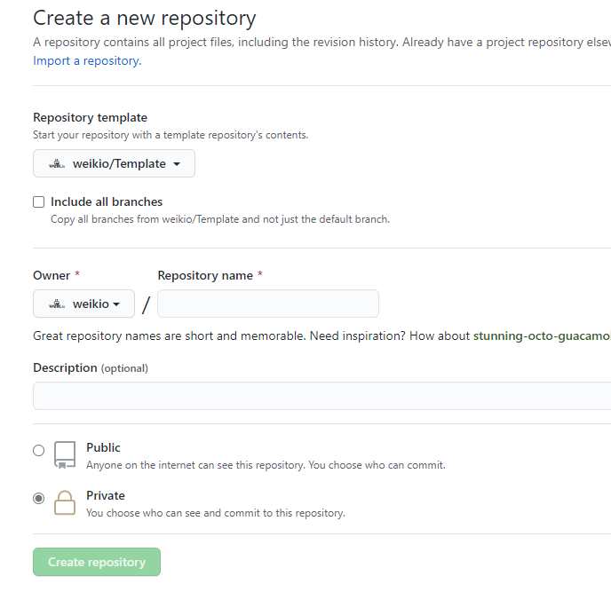
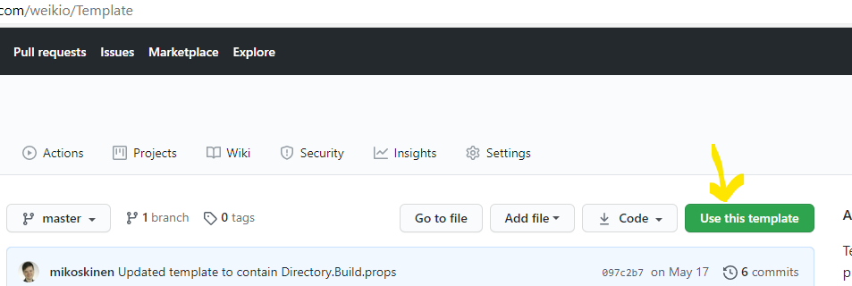

# Weik.io Template
 
Template for Weik.io's .NET Core projects. Contains the following constructs:

* Coding conventions in the format of .editorconfig.
* Folder structure
* Global.json
* Git ignore

This template can be used as a starting point for all the Weik.io projects.

## Usage

The template can be used when creating a new repository in GitHub:

Select Weikio/Template from the Repository teamplte dropdown.

Alternatively a new repository with this template can be created from https://github.com/weikio/Template:

## License

This template is MIT licensed.